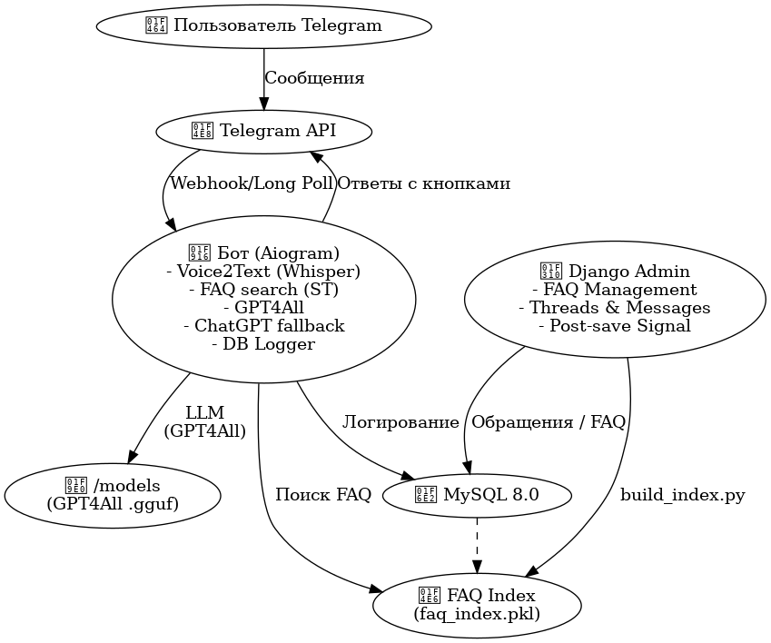

# 🤖 Telegram Support Bot

AI-бот службы поддержки с голосовыми сообщениями, умным поиском по FAQ, fallback-ответами от GPT4All или ChatGPT и веб-админкой на Django.

## 📦 Функции

- 🎙️ Распознавание голосовых сообщений (Whisper)
- 📚 Поиск по FAQ на основе смысловых векторов (Sentence Transformers)
- 💬 Fallback ответы через:
  - GPT4All (локально)
  - ChatGPT (через OpenAI API)
- 🧾 Логирование сообщений в базу
- 🛠️ Django-админка:
  - Просмотр и ответ по обращениям
  - Добавление/редактирование FAQ
  - Кнопка «📌 Зберегти в FAQ» для ответа администратора
- ✅ Кнопки «Допомогло / Не допомогло» для пользователей
- 🔁 Автоматическое обновление индекса FAQ при изменении

## 🧱 Архитектура



## 🚀 Развёртывание

```bash
git clone https://github.com/your-org/telegram-support-bot.git
cd telegram-support-bot

cp .env.example .env  # настрой переменные
docker compose up --build
